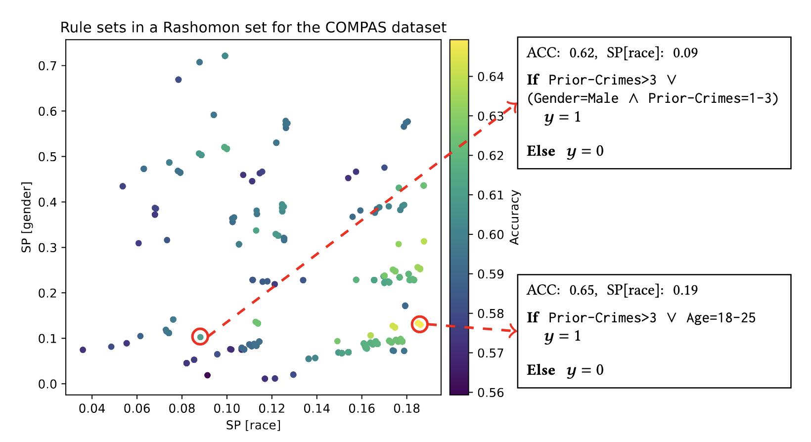

# Efficient algorithms to explore the Rashomon set of rule set models

This repository contains the source code of the paper *"[Efficient Exploration of the Rashomon Set of Rule Set Models](https://arxiv.org/pdf/2406.03059)"* (KDD 2024)

## What is a Rashomon set and why studying it?

*The Rashomon set* of an ML problem refers to the set of models of near-optimal predictive performance.

**Why studying it?** Because models with similar performance may exhibit *drastically different* properties (such as fairness), therefore a single model does not offer an adequate representation of the reality.

An example showcasing the Rashomon set of rule set models for the [COMPAS](https://www.propublica.org/datastore/dataset/compas-recidivism-risk-score-data-and-analysis) dataset.

- Each rule set is plotted as a point, whose position is determined by the statistical parity (`SP`) of the rule set on race and gender (in the X and Y axis, respectively).
  - Statistical parity quantifies the fairness of classification models.
- You can see that two highlighted models have very different `SP[race]` scores, though their accuracy scores are close.



## Project overview

- We designed efficient algorithms to explore the Rashomon set of rule-set models for binary classification problems.
  - we focus on rule set models, due to their inherent interpretability.
- We investigated two exploration modes -- *counting* and *uniform sampling* from the Rashomon set.
- Instead of tackling exact counting and uniform sampling, we study the approximate versions of them, which reduces the search space drastically.
- For both problems, we invented theoretically-sound algorithms sped up by effective pruning bounds, and a efficient implementation of it powered by Numba and Ray.
  - Compared to off-the-shelf tools (such as [Google OR-tools](https://github.com/google/or-tools)), our implementation is often **>1000x faster**

## Environment setup

The source code is tested against Python 3.8 on MacOS 14.2.1

``` shell
pip install -r requirements.txt
```


Verify that unit tests pass

``` shell
pytest tests
```

## Example usage

We illustrate the usage of approximate counter and almost-uniform sampler applied on synthetic data.

### Preparation

Set up a Ray cluster for parallel computing, e.g.,

``` python
import ray
ray.init()
```

### Approximate counting

``` python
from bds.rule_utils import generate_random_rules_and_y
from bds.meel import approx_mc2

ub = 0.9  # upper bound on the rule set objective function
lmbd = 0.1  # complexity penalty term

eps = 0.8  # error parameter related to estimation accuracy
delta = 0.8  # the estimation confidence parameter


num_pts, num_rules = 100, 10
# generate the input data
random_rules, random_y = generate_random_rules_and_y(
    num_pts, num_rules, rand_seed=42
)

# get an approximate estimation of the number of good rule set models
estimated_count = approx_mc2(
    random_rules,
    random_y,
    lmbd=lmbd,
    ub=ub,
    delta=delta,
    eps=eps,
    rand_seed=42,
    parallel=True,  # using paralle run
)
```

### Almost uniform sampling


``` python
from bds.rule_utils import generate_random_rules_and_y
from bds.meel import UniGen

num_pts, num_rules = 100, 10
random_rules, random_y = generate_random_rules_and_y(
    num_pts, num_rules, rand_seed=42
)

ub = 0.9
eps = 8 #  epsilon parameter that controls the closeness between the sampled distribution and uniform distribution
lmbd = 0.1  # complexity penalty term

sampler = UniGen(random_rules, random_y, lmbd, ub, eps, rand_seed=42)

sampler.prepare()  # collect necessary statistics required for sampling

# sample 10 rule sets almost uniformly from the Rashomon set
samples = sampler.sample(10, exclude_none=True)
```

### Candidate rules extraction on real-world datasets

When working with real-world datasets, the first step is often extract a list of candidate rules.

For this purpose, you may rely on `extract_rules_with_min_support` to extract a list of rules with support above a given threshold.

``` python
import pandas as pd
from bds.candidate_generation import extract_rules_with_min_support

dataset = "compas"
data = pd.read_csv('data/compas_train-binary.csv')  # the features are binary
X = data.to_numpy()[:,:-2]  # extract the feature matrix

attribute_names = list(data.columns[:-2])

candidate_rules = extract_rules_with_min_support(X, attribute_names, min_support=70)

# then you may apply the sampler or count estimator on the candidate rules
```

## Contact persons

- Han Xiao: xiaohan2012@gmail.com
- Martino Ciaperoni: martino.ciaperoni@aalto.fi

## Citing this work

If you find this work useful, please consider citing it.

<details>
<summary>Bibtex entry</summary>

``` bibtex
@inproceedings{ciaperoni2024efficient,
  title={Efficient Exploration of the Rashomon Set of Rule-Set Models},
  author={Ciaperoni, Martino and Xiao, Han and Gionis, Aristides},
  booktitle={Proceedings of the 30th ACM SIGKDD Conference on Knowledge Discovery and Data Mining},
  pages={478--489},
  year={2024}
}
```

</details>


## TODO

- [ ] rename package to `ers`
- [ ] packaging
- [ ] maybe add a logo?
